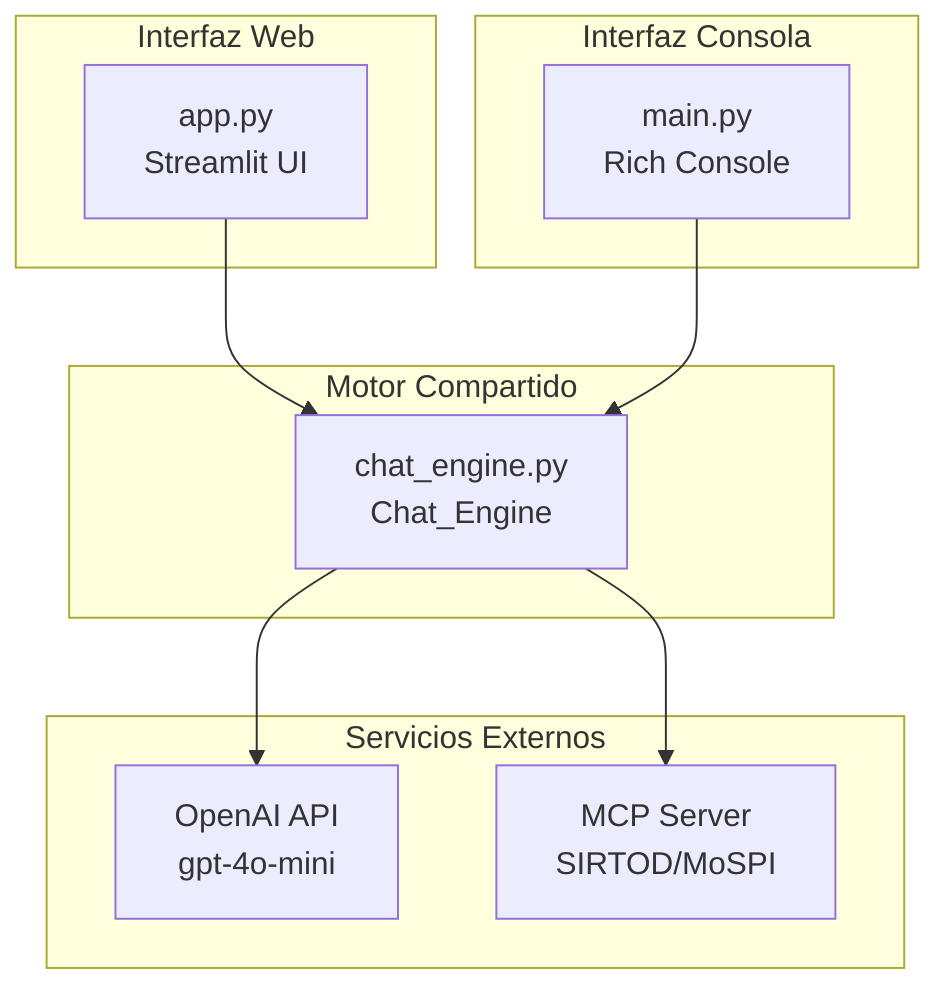
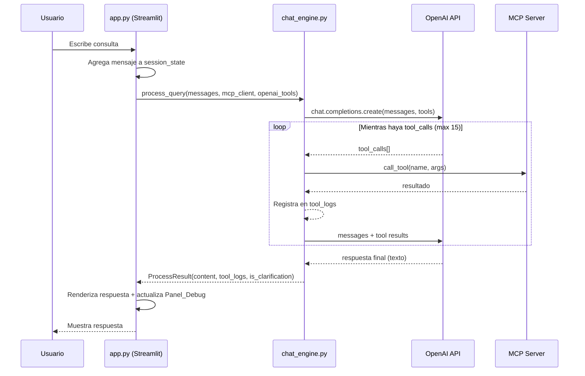

# Documento de Diseño: Streamlit Chatbot UI

## Descripción General

Este diseño describe la arquitectura para construir una interfaz web de chatbot usando Streamlit que reutiliza la lógica existente de `main.py` (MCP + OpenAI). El enfoque principal es extraer la lógica de negocio en un módulo `chat_engine.py` reutilizable, y crear una aplicación Streamlit (`app.py`) que consuma ese módulo para ofrecer una experiencia de chat web con panel de depuración colapsable.

La aplicación mantiene la compatibilidad con el flujo de consola existente en `main.py`, que pasará a importar desde `chat_engine.py` en lugar de contener la lógica directamente.

## Arquitectura

### Diagrama de Componentes



### Diagrama de Flujo de una Consulta



## Componentes e Interfaces

### 1. `chat_engine.py` — Motor de Chat Compartido

Módulo que encapsula toda la lógica de negocio extraída de `main.py`. Expone funciones asíncronas puras que no dependen de ninguna interfaz (ni Rich ni Streamlit).


#### Constantes exportadas

- `OPENAI_MODEL`: `"gpt-4o-mini"`
- `SYSTEM_PROMPT`: El prompt del sistema (idéntico al actual en `main.py`)
- `MAX_ITERATIONS`: `15`

#### Funciones exportadas

```python
def mcp_tools_to_openai(mcp_tools: list) -> list[dict]:
    """Convierte herramientas MCP al formato OpenAI. Sin cambios respecto a main.py."""

def is_clarification_request(content: str | None) -> bool:
    """Detecta si el contenido es una solicitud de aclaración (ACLARACION_USUARIO:)."""

@dataclass
class ToolCallLog:
    """Registro de una llamada a herramienta."""
    name: str
    arguments: dict
    result: str
    is_error: bool

@dataclass
class ProcessResult:
    """Resultado del procesamiento de una consulta."""
    content: str
    tool_logs: list[ToolCallLog]
    is_clarification: bool
    iterations: int
    hit_max_iterations: bool

async def connect_mcp(server_url: str) -> Client:
    """Crea y retorna un cliente MCP conectado."""

async def discover_tools(mcp_client: Client) -> tuple[list, list[dict]]:
    """Descubre herramientas MCP y retorna (mcp_tools, openai_tools)."""

async def process_query(
    messages: list[dict],
    mcp_client: Client,
    openai_tools: list[dict],
    openai_client: OpenAI,
) -> ProcessResult:
    """
    Ejecuta el ciclo completo de consulta:
    1. Envía messages a OpenAI con tools
    2. Ejecuta tool_calls en MCP (hasta MAX_ITERATIONS)
    3. Retorna ProcessResult con la respuesta y logs

    IMPORTANTE: Modifica `messages` in-place agregando los mensajes
    del asistente, herramientas y respuesta final.
    """
```

#### Decisión de diseño: `messages` in-place

`process_query` modifica la lista `messages` directamente. Esto simplifica la gestión del estado tanto en Streamlit (`st.session_state.messages`) como en el flujo de consola, evitando copias innecesarias y manteniendo la referencia compartida.

### 2. `app.py` — Aplicación Streamlit

Archivo principal de la interfaz web. Responsable únicamente de la presentación y gestión del estado de sesión.

#### Estructura de la página

```
┌─────────────────────────────────────────┐
│  Sidebar (Panel_Debug)                  │
│  ┌───────────────────────────────────┐  │
│  │ 🔧 Llamadas a Herramientas       │  │
│  │ [Expander por cada tool_call]     │  │
│  │   - Nombre + Args (JSON)          │  │
│  │   - Resultado (truncado a 2000)   │  │
│  └───────────────────────────────────┘  │
│  [🗑️ Nueva conversación]               │
├─────────────────────────────────────────┤
│  Área principal                         │
│  ┌───────────────────────────────────┐  │
│  │ 📊 Asistente SIRTOD              │  │
│  │ Descripción breve                 │  │
│  ├───────────────────────────────────┤  │
│  │ 💬 Chat messages                  │  │
│  │   user: ...                       │  │
│  │   assistant: ...                  │  │
│  │   user: ...                       │  │
│  │   assistant: ...                  │  │
│  ├───────────────────────────────────┤  │
│  │ [Escribe tu consulta...]          │  │
│  └───────────────────────────────────┘  │
└─────────────────────────────────────────┘
```

#### Componentes Streamlit utilizados

| Componente | Uso |
|---|---|
| `st.sidebar` | Panel_Debug con herramientas y botón de nueva conversación |
| `st.chat_message` | Renderizar mensajes de usuario y asistente |
| `st.chat_input` | Campo de entrada de texto |
| `st.spinner` | Indicador de procesamiento |
| `st.expander` | Cada tool_call dentro del sidebar |
| `st.code` | Mostrar JSON de argumentos y resultados |
| `st.error` | Mensajes de error de conexión |
| `st.session_state` | Persistencia de estado entre rerenders |

#### Flujo de inicialización

1. Verificar `OPENAI_API_KEY` en variables de entorno → si falta, `st.error()` y `st.stop()`
2. Si `st.session_state` no tiene `mcp_client`:
   - Conectar MCP via `chat_engine.connect_mcp()`
   - Descubrir herramientas via `chat_engine.discover_tools()`
   - Inicializar `messages` con `SYSTEM_PROMPT`
   - Almacenar todo en `st.session_state`
3. Si la conexión MCP falla → `st.error()` y `st.stop()`

#### Flujo de interacción

1. Usuario escribe en `st.chat_input`
2. Se agrega mensaje `user` a `st.session_state.messages`
3. Se muestra `st.spinner("Procesando...")`
4. Se llama `await chat_engine.process_query(...)` usando `asyncio.run()`
5. Se recibe `ProcessResult`
6. Se agregan los `tool_logs` a `st.session_state.tool_logs`
7. Se re-renderiza el chat y el sidebar

### 3. `main.py` — Consola (refactorizado)

Se simplifica para importar desde `chat_engine.py`. Mantiene toda la visualización Rich pero delega la lógica a `chat_engine`. La función `run()` sigue el mismo patrón pero usa `process_query()` y luego renderiza los `ToolCallLog` con Rich.

## Modelos de Datos

### Estado de Sesión (`st.session_state`)

```python
# Claves en st.session_state
{
    "messages": list[dict],          # Historial OpenAI (incluye system prompt)
    "mcp_client": Client,            # Cliente MCP conectado
    "openai_client": OpenAI,         # Cliente OpenAI
    "openai_tools": list[dict],      # Herramientas en formato OpenAI
    "tool_logs": list[ToolCallLog],  # Logs acumulados de todas las consultas
    "initialized": bool,             # Flag de inicialización exitosa
}
```

### ToolCallLog

```python
@dataclass
class ToolCallLog:
    name: str           # Nombre de la herramienta MCP
    arguments: dict     # Argumentos enviados (dict JSON)
    result: str         # Texto del resultado
    is_error: bool      # True si la ejecución falló
```

### ProcessResult

```python
@dataclass
class ProcessResult:
    content: str                  # Respuesta final del asistente
    tool_logs: list[ToolCallLog]  # Logs de herramientas de esta consulta
    is_clarification: bool        # True si es ACLARACION_USUARIO:
    iterations: int               # Número de iteraciones ejecutadas
    hit_max_iterations: bool      # True si se alcanzó el límite
```

### Formato de mensajes OpenAI

Se mantiene el formato estándar de la API de OpenAI:

```python
# Mensaje de sistema
{"role": "system", "content": "..."}

# Mensaje de usuario
{"role": "user", "content": "..."}

# Mensaje de asistente (con tool_calls)
{"role": "assistant", "content": None, "tool_calls": [...]}

# Resultado de herramienta
{"role": "tool", "tool_call_id": "...", "content": "..."}

# Respuesta final del asistente
{"role": "assistant", "content": "..."}
```


## Propiedades de Correctitud

*Una propiedad es una característica o comportamiento que debe cumplirse en todas las ejecuciones válidas de un sistema — esencialmente, una declaración formal sobre lo que el sistema debe hacer. Las propiedades sirven como puente entre especificaciones legibles por humanos y garantías de correctitud verificables por máquina.*

### Propiedad 1: Conversión MCP-a-OpenAI preserva estructura

*Para cualquier* herramienta MCP válida con nombre, descripción y esquema de parámetros, `mcp_tools_to_openai` debe producir un diccionario OpenAI donde `function.name` sea igual al nombre original, `function.description` sea igual a la descripción original, y `function.parameters` sea igual al `inputSchema` original.

**Valida: Requisitos 1.2**

### Propiedad 2: El historial de mensajes crece tras cada consulta

*Para cualquier* lista de mensajes inicial y consulta válida, después de ejecutar `process_query`, la longitud de la lista de mensajes debe ser estrictamente mayor que la longitud inicial (al menos se agrega el mensaje del asistente con la respuesta).

**Valida: Requisitos 2.6, 3.2**

### Propiedad 3: Cada tool_call genera un mensaje tool correspondiente

*Para cualquier* respuesta de OpenAI que contenga N tool_calls, después de procesar esa iteración, la lista de mensajes debe contener exactamente N mensajes nuevos con `role: "tool"`, cada uno con un `tool_call_id` que corresponda a uno de los tool_calls originales.

**Valida: Requisitos 3.2**

### Propiedad 4: process_query termina dentro del límite de iteraciones

*Para cualquier* secuencia de respuestas de OpenAI (incluyendo aquellas que siempre contienen tool_calls), `process_query` debe terminar y el campo `iterations` del resultado debe ser menor o igual a `MAX_ITERATIONS` (15). Si se alcanza el límite, `hit_max_iterations` debe ser `True`.

**Valida: Requisitos 3.3, 3.4**

### Propiedad 5: Detección de solicitudes de aclaración

*Para cualquier* cadena de texto, `is_clarification_request` debe retornar `True` si y solo si la cadena (sin espacios iniciales) comienza con `"ACLARACION_USUARIO:"`. Para cadenas `None` o vacías, debe retornar `False`.

**Valida: Requisitos 3.6**

### Propiedad 6: Integridad de datos en ToolCallLog

*Para cualquier* ejecución de herramienta durante `process_query`, el `ToolCallLog` resultante debe contener un `name` no vacío, un diccionario `arguments` válido (serializable a JSON), y un `result` de tipo string. Si la herramienta falló, `is_error` debe ser `True` y `result` debe contener el mensaje de error.

**Valida: Requisitos 4.2, 3.5**

### Propiedad 7: Truncamiento de resultados largos

*Para cualquier* cadena de texto con longitud mayor a 2000 caracteres, la función de truncamiento debe retornar una cadena de longitud menor o igual a 2000 caracteres más un indicador de truncamiento. Para cadenas de 2000 caracteres o menos, debe retornar la cadena sin modificar.

**Valida: Requisitos 4.5**

## Manejo de Errores

### Errores de Inicialización

| Error | Causa | Manejo |
|---|---|---|
| `OPENAI_API_KEY` ausente | Variable de entorno no configurada | `st.error()` con mensaje descriptivo + `st.stop()` |
| Conexión MCP fallida | Servidor MCP no disponible o URL incorrecta | `st.error()` con URL intentada + `st.stop()` |
| Descubrimiento de herramientas falla | Servidor MCP responde pero no lista herramientas | `st.error()` + `st.stop()` |

### Errores en Tiempo de Ejecución

| Error | Causa | Manejo |
|---|---|---|
| Tool_Call falla | Herramienta MCP lanza excepción | Se captura la excepción, se registra como `ToolCallLog(is_error=True)`, se envía el error como contenido del mensaje `tool` a OpenAI para que el modelo pueda reaccionar |
| OpenAI API error | Rate limit, timeout, error de red | Se captura la excepción, se muestra `st.error()` con el mensaje, se permite al usuario reintentar |
| Límite de iteraciones | Más de 15 ciclos de tool_calls | `process_query` retorna con `hit_max_iterations=True`, la UI muestra advertencia |
| Respuesta vacía de OpenAI | El modelo no genera contenido | Se usa `"(sin respuesta)"` como contenido por defecto |

### Estrategia de reintentos

No se implementan reintentos automáticos. El usuario puede reenviar la consulta manualmente. Esto mantiene la simplicidad y evita costos inesperados en la API de OpenAI.

## Estrategia de Testing

### Enfoque Dual

Se utilizan dos tipos de tests complementarios:

1. **Tests unitarios**: Verifican ejemplos específicos, casos borde y condiciones de error
2. **Tests basados en propiedades**: Verifican propiedades universales sobre todos los inputs posibles

### Librería de Property-Based Testing

Se usará **Hypothesis** (`hypothesis` para Python), la librería estándar de PBT para Python.

### Tests Basados en Propiedades

Cada propiedad del documento de diseño se implementará como un test individual con Hypothesis. Configuración mínima: 100 iteraciones por test.

| Propiedad | Test | Generador |
|---|---|---|
| P1: Conversión MCP-a-OpenAI | Generar herramientas MCP con nombre, descripción y schema aleatorios → verificar estructura del output | `st.text()`, `st.dictionaries()` |
| P2: Mensajes crecen | Generar lista de mensajes inicial + mock de OpenAI que retorna texto → verificar `len(messages)` crece | `st.lists()` de mensajes válidos |
| P3: Tool_calls → tool messages | Mock de OpenAI con N tool_calls aleatorios → verificar N mensajes tool en resultado | `st.integers(1, 5)` para N, generadores de tool_calls |
| P4: Terminación | Mock de OpenAI que siempre retorna tool_calls → verificar que termina en ≤15 iteraciones | Implícito en el mock |
| P5: Detección de aclaración | Generar strings aleatorios con/sin prefijo ACLARACION_USUARIO: → verificar detección | `st.text()`, `st.just("ACLARACION_USUARIO:")` |
| P6: Integridad ToolCallLog | Generar tool_calls con resultados/errores aleatorios → verificar campos del log | `st.text()`, `st.dictionaries()`, `st.booleans()` |
| P7: Truncamiento | Generar strings de longitud variable → verificar truncamiento correcto | `st.text(min_size=0, max_size=5000)` |

Cada test debe incluir un comentario de referencia con el formato:
```python
# Feature: streamlit-chatbot-ui, Property 1: Conversión MCP-a-OpenAI preserva estructura
```

### Tests Unitarios

Los tests unitarios cubren ejemplos específicos y casos borde:

- Inicialización con API key válida/inválida
- Conexión MCP exitosa/fallida
- Reinicio de conversación (messages vuelve a solo system prompt)
- Respuesta con formato ACLARACION_USUARIO: específico
- Tool_call que lanza excepción específica
- ProcessResult con `hit_max_iterations=True`
- Truncamiento exacto en el límite de 2000 caracteres

### Estructura de archivos de test

```
tests/
  test_chat_engine.py      # Tests unitarios y de propiedades del motor
  conftest.py              # Fixtures compartidos (mocks de OpenAI, MCP)
```

